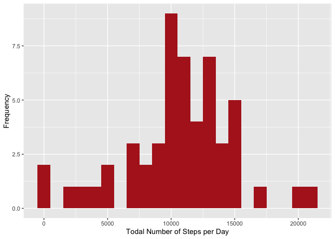
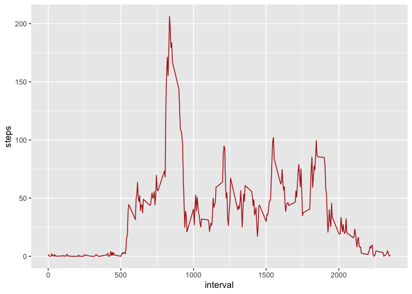
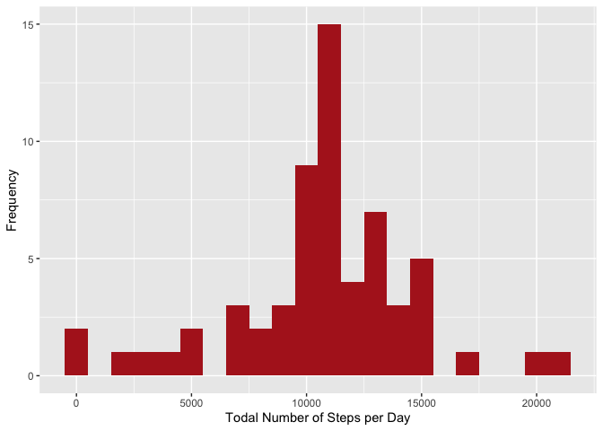
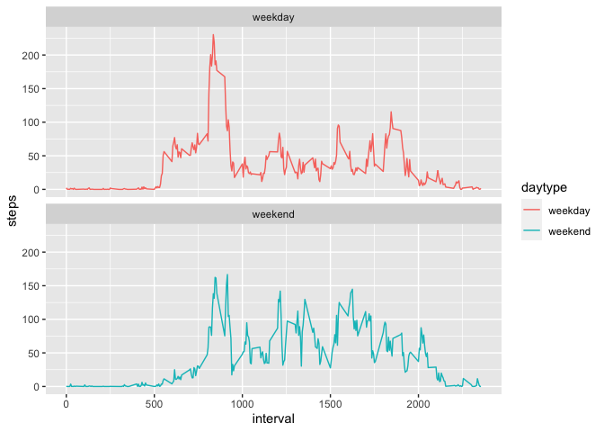

# Reproducible Research Week 2 Assignment 1 by Metehan Soysal
This is the document that explains the steps taken to prepare the assingment for Reproducible Research Asssigment 1.

## Loading and preprocessing the data
### Libraries and Loading the Data
In order to complete the assignment we need to first load the required libraries and the data.


```r
library(lubridate)
```

```
## Loading required package: timechange
```

```
## 
## Attaching package: 'lubridate'
```

```
## The following objects are masked from 'package:base':
## 
##     date, intersect, setdiff, union
```

```r
library(ggplot2)
library(dplyr)
```

```
## 
## Attaching package: 'dplyr'
```

```
## The following objects are masked from 'package:stats':
## 
##     filter, lag
```

```
## The following objects are masked from 'package:base':
## 
##     intersect, setdiff, setequal, union
```

```r
act_data <- read.csv("activity.csv", header = TRUE, sep = ',', colClasses = c("numeric", "character", "integer"))
```

### Tidying the Data
We need to convert the date column from character to date format. We will use lubridate package and ymd function for that.

```r
act_data$date <- ymd(act_data$date)
```

## What is mean total number of steps taken per day?
### Calculate the steps taken by day
We will first calculate the steps taken per day and will use group_by function to do that. We also need to omit NA values.


```r
daily_steps <- act_data %>%
  na.omit() %>%
  group_by(date) %>%
  summarize(daily_steps = sum(steps))
  print(daily_steps)
```

```
## # A tibble: 53 × 2
##    date       daily_steps
##    <date>           <dbl>
##  1 2012-10-02         126
##  2 2012-10-03       11352
##  3 2012-10-04       12116
##  4 2012-10-05       13294
##  5 2012-10-06       15420
##  6 2012-10-07       11015
##  7 2012-10-09       12811
##  8 2012-10-10        9900
##  9 2012-10-11       10304
## 10 2012-10-12       17382
## # … with 43 more rows
```
### Constructing the Plot
We will use ggplot library to create the plot.

```r
daily_plot<- ggplot(daily_steps, aes(x=daily_steps)) + geom_histogram(fill = "firebrick", binwidth = 1000) + xlab("Todal Number of Steps per Day") + ylab("Frequency")
print(daily_plot)
```

<!-- -->

### Calculating the Mean and the Median

```r
mean_daily_steps <- mean(daily_steps$daily_steps, na.rm = TRUE)
mean_daily_steps
```

```
## [1] 10766.19
```

```r
median_daily_steps <- median(daily_steps$daily_steps, na.rm = TRUE)
median_daily_steps
```

```
## [1] 10765
```

## What is the average daily activity pattern?
### Calculate the Average Steps

```r
interval_steps <- act_data %>% 
  na.omit() %>% 
  group_by(interval) %>% 
  summarize(steps = mean(steps))
head(interval_steps)
```

```
## # A tibble: 6 × 2
##   interval  steps
##      <int>  <dbl>
## 1        0 1.72  
## 2        5 0.340 
## 3       10 0.132 
## 4       15 0.151 
## 5       20 0.0755
## 6       25 2.09
```
### Plotting the Average Daily Activity

```r
avg_steps <- ggplot(interval_steps, aes(x=interval, y=steps)) + geom_line(color = "firebrick")
print(avg_steps)
```

<!-- -->

### Finding the Maximum Steps Occurrence in a Time Interval

```r
interval_steps[which.max(interval_steps$steps),]
```

```
## # A tibble: 1 × 2
##   interval steps
##      <int> <dbl>
## 1      835  206.
```

## Imputing missing values
### Calculating the Missing Values

```r
sum(is.na(act_data$steps))
```

```
## [1] 2304
```

```r
sum(is.na(act_data$interval))
```

```
## [1] 0
```

```r
sum(is.na(act_data$date))
```

```
## [1] 0
```

### Fill-in the missing values
We will use the interval average steps to fill in for the missing values.

```r
act_data_filled <- cbind(act_data, interval_steps$steps)
names(act_data_filled) <- c("steps", "date", "interval", "average")

for (i in 1:length(act_data_filled$interval)) {
  if (is.na(act_data_filled[i,1])){
    act_data_filled[i,1] <- act_data_filled[i,4]}
  }
```

### Re-drawing the histogram with the filled values

```r
daily_steps_filled <- act_data_filled %>%
      na.omit() %>%
      group_by(date) %>%
      summarize(daily_steps = sum(steps))
print(daily_steps_filled)
```

```
## # A tibble: 61 × 2
##    date       daily_steps
##    <date>           <dbl>
##  1 2012-10-01      10766.
##  2 2012-10-02        126 
##  3 2012-10-03      11352 
##  4 2012-10-04      12116 
##  5 2012-10-05      13294 
##  6 2012-10-06      15420 
##  7 2012-10-07      11015 
##  8 2012-10-08      10766.
##  9 2012-10-09      12811 
## 10 2012-10-10       9900 
## # … with 51 more rows
```

```r
daily_plot_filled <- ggplot(daily_steps_filled, aes(x=daily_steps)) + geom_histogram(fill = "firebrick", binwidth = 1000) + xlab("Todal Number of Steps per Day") + ylab("Frequency")
print(daily_plot_filled)
```

<!-- -->

Calculating the mean and the median of the full data set.

```r
mean_daily_steps_filled <- mean(daily_steps_filled$daily_steps)
mean_daily_steps_filled
```

```
## [1] 10766.19
```

```r
median_daily_steps_filled <- median(daily_steps_filled$daily_steps)
median_daily_steps_filled
```

```
## [1] 10766.19
```


## Are there differences in activity patterns between weekdays and weekends?
We will create extra variables to find out if the date represents a weekday or a weekend.
First we calculate the actual day of the week which date represents.

```r
act_data_filled$day <- weekdays(act_data_filled$date)
```
We will then use this function below to find out whether this is a weekend or a weekday.

```r
daytype <- function(day) {
  if (day %in% c("Saturday", "Sunday")){"weekend"} 
  else {"weekday"}
  }
```
We will then create a new column for each date to find out whether it is a weekday or a weekend.

```r
act_data_filled$daytype <- as.factor(sapply(act_data_filled$day, daytype))
table(act_data_filled$daytype)
```

```
## 
## weekday weekend 
##   12960    4608
```

Now we will calculate the average steps in the intervals

```r
interval_filled <- act_data_filled %>%
  group_by(interval, daytype) %>%
  summarise(steps = mean(steps))
```

```
## `summarise()` has grouped output by 'interval'. You can override using the
## `.groups` argument.
```

We will go ahead and create a plot to show the differences between weekdays and weekends.

```r
interval_filled_plot <- ggplot(interval_filled, aes(x=interval, y=steps, color = daytype)) + geom_line() + facet_wrap(~daytype, ncol =1, nrow=2)
print(interval_filled_plot)
```

<!-- -->


